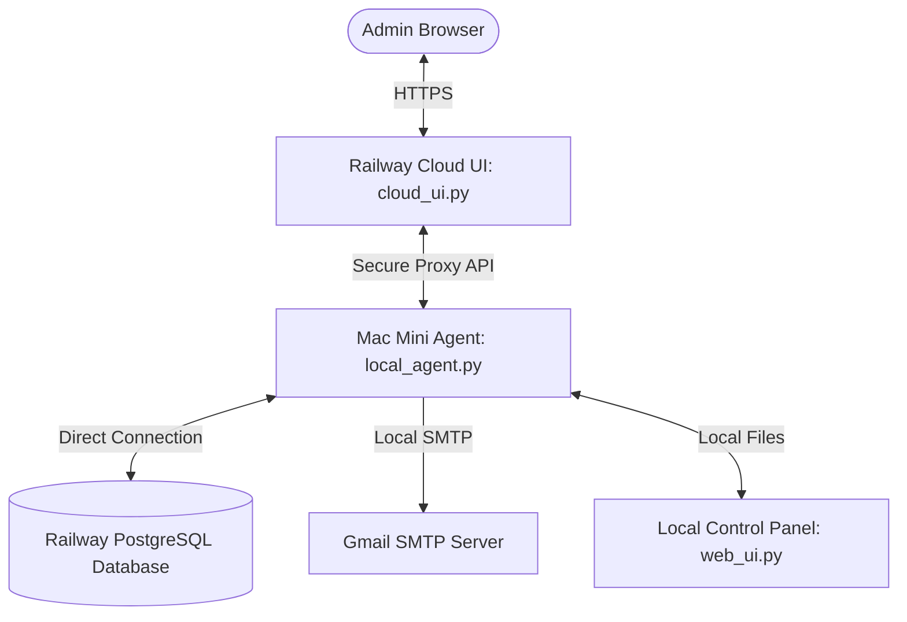

# Poker Now Automation Tools

This repository contains a suite of Python scripts to automate setting up game rooms on Poker Now, announcing tables to Google Calendar/Groups/Discord, and calculating settlements from game cashout ledgers.

All active automation runs locally out of your SSD folder (e.g. `~/pokernow`), and replicates changes to Google Drive via a slave replica sync.

---

## Tools Overview

1. **Lobby Setup Automation** (`setup_poker_auth.py` & `login.py`)
   - Logs into your Poker Now owner lobby.
   - **Hybrid OS-Level Bypass & Pure JS Injection**: Completely evades Cloudflare Turnstile bot protection by launching a *clean* Chrome instance without Playwright or CDP. 
   - **Preserves Active Session**: Keeps the original Chrome window open to prevent LevelDB session corruption and guarantee that Game Configurations are accessible as the fully authenticated Room Owner.
   - **Flawless DOM Traversal & Mithril.js Sync**: Uses AppleScript to inject highly advanced JavaScript DOM traversal directly into the active tab. It intelligently handles Mithril.js virtual DOM race conditions by asynchronously staggering input typing and button clicking, guaranteeing the UI state is synced before form submission.
   - **macOS System Permissions**: Native OS-level AppleScript injection requires the "Allow JavaScript from Apple Events" permission to be enabled in Chrome (`View > Developer > Allow JavaScript from Apple Events`). The script includes diagnostic logging to automatically surface if this permission is revoked by Chrome updates.
   - Copies ready-to-share links and commands to the clipboard along with an email subject line.
   - (Playwright is preserved only for background automated settlement parsing where Turnstile is not active).
2. **Automated Scheduler** (`setup_local_scheduler.py`)
   - Configures macOS `launchd` CalendarIntervals to run game setup and settlement calculations automatically.
   - Registers a persistent Web UI dashboard daemon to run on boot.
3. **Game Announcer** (`announce_games.py` & `update_calendar.py`)
   - Automatically runs table setups based on the day's config in `schedule.json`.
   - Sends rich email announcements to Google Groups.
   - Creates/updates game entries dynamically in Google Calendar.
4. **Auto Settlement Engine** (`auto_settle.py` & `pokernow_settlement.py`)
   - Automatically runs morning calculations, downloads cashout CSVs, optimizes transactions, generates HTML reports, and emails payouts.
    - **Remote Web UI Control Panel** (`web_ui.py`)
      - Serves a secure, zero-dependency local dashboard on port `8080` (accessible over Tailscale).
      - Allows triggering announcer and settlement scripts manually with log outputs visible in real time.
      - **Diagnostic Advisor**: Automatically parses and triages stdout/stderr outputs to identify common issues (e.g., SMTP auth failures, missing Playwright executables, missing player mappings) and displays clear recovery steps.
        - **Timestamps**: Prominently shows active run error/success timestamps directly in the header.
        - **Diagnostic History & Acknowledgment**: Lists the last 3 historical errors. You can expand their resolution steps or click **Acknowledge** to dismiss active warning glows and track acknowledgment state persistently in `data/acknowledged_errors.json`.
        - **Interactive Copyable Nicknames**: On player mapping errors, the missing nickname is displayed as a badge (`nickname 📋`) that copies the clean text to your clipboard when clicked, making it quick and easy to add to your spreadsheet.
        - **Smart URL Parsing**: Reconciliations accept copy-pasted email blocks (e.g. `Table 1 - NLH <https://.../games/pgl...>`), automatically ignoring text prefixes and stripping trailing characters like `>` before download.
      - **Active vs. Stale Log Tracking**: Extracts execution and error timestamps to label error boxes with status badges (`[ACTIVE ERROR]`, `[STALE / RESOLVED]`, or `[SUCCESS]`). Stale/old error panels are dimmed with hover-reveal styling to prevent confusion.
      - **Clipboard Shortcuts**: Copy buttons next to each console log panel allow for quick sharing/debugging of stack traces.
      - **Static Settlement Inputs**: Settlement UI has been redesigned to use dark-themed static input fields instead of annoying popup browser prompts, allowing seamless copy/pasting from external tabs.
      - **Decoupled Ad-Hoc Sessions & Kill Switch**: Allows you to run custom ad-hoc tables independent of the main schedule. Alternatively, flip the new **Kill Switch** toggle on the Schedule Editor to cleanly skip tonight's scheduled automatic table creation.
    - **Replication Script** (`sync_to_drive.sh`)
      - Replicates local changes and logs back to your Google Drive backup.

---

## Installation & Setup

### 1. Prerequisites
Install Python 3 and the required libraries:
```bash
pip install playwright pandas requests networkx ortools
```

### 2. Persistent Playwright Browser
Set custom environment path and install Playwright Chromium directly into the workspace:
```bash
PLAYWRIGHT_BROWSERS_PATH=./playwright-browsers python3 -m playwright install chromium
```

### 3. Login Setup (First Time Only)
Run `login.py` once to authenticate your Poker Now account and establish a persistent browser profile:
```bash
python3 login.py
```
- A headed Chromium browser will launch.
- Log in to your Poker Now account (e.g., via Google).
- Once logged in, press **Enter** in your terminal window to save the session locally in `./chrome-profile`.

### 4. Scheduler & Web UI Installation
Register the launchd agents for automated execution and remote-control UI: 
```bash
python3 setup_local_scheduler.py
```
- **Web UI Control Panel**: Starts immediately and runs in the background on port `8080` (access via `http://<tailscale-ip>:8080` when on Tailscale).
- **Game Announcements**: Triggers automatically at **5:00 PM** (Mon, Wed, Fri, Sat).
- **Settlements**: Runs automatically at **8:00 AM** (Tue, Thu, Sat, Sun).

**⚠️ Important**: Changing `schedule.json` while the UI is running can cause `ERR_CONNECTION_REFUSED` because the launch agent reload stops the web UI mid‑request. 
To avoid this, run the scheduler with the new flag:
```bash
python3 setup_local_scheduler.py --skip-web-ui
```
This reloads only the `game_nights` and `next_morning` agents, leaving the UI daemon running and preventing the connection error.
Use the flag only when you are editing the schedule; for code changes or full restarts run the script without the flag.
```bash
python3 setup_local_scheduler.py
```

---

## Configuration & Security

- **`schedule.json`**: Configures specific game formats, blinds, and tables for each weekday.
- **`.env`**: Stores secure SMTP settings, Google Sheet CSV URL, Discord Webhook, and Google Calendar ID.
- **`payment_info.csv`**: Maps player aliases on Poker Now (`PN Alias`) to Venmo handles.
- **Email Notification Branding**: Automated emails are sent with the display name `LCR Admins` and include a built-in feedback footer directing questions, suggestions, or improvements to `lcr-poker-admins@googlegroups.com`.
- **⚠️ Personal Data**: Do **NOT** publish `.env`, `calendar_credentials.json`, `payment_info.csv` or the `chrome-profile/` directory to public repositories. They are excluded by `.gitignore`.

---

## Remote Access & Hybrid Database Architecture

The control panel and analytics system use a **decoupled cloud-to-local hybrid architecture** to allow secure remote administration of your Poker Now automation tools while bypassing network constraints:

### Component Breakdown: What Runs Where



#### 1. Railway Cloud UI (`cloud_ui.py`)
- Runs on **Railway** (`https://poker.gchew.com`) inside a secure, zero-dependency Docker container.
- Serves as the **secure gatekeeper** for the control panel (`/`) and player performance dashboard (`/analytics`).
- Enforces an automated **30-minute session limit** with a floating visual HUD countdown timer in the bottom-right corner.
- **Session Authentication (OTP)**: Validates user identity and coordinates with the Mac Mini to send email OTP codes.

#### 2. Mac Mini Local Agent (`local_agent.py` - Port 8081)
- Runs locally on your Mac Mini as a background macOS `launchd` service.
- **SMTP Gateway**: Sends OTP and settlement emails via your local network (bypassing Railway's outbound SMTP block).
- **Database Handler**: Connects to the Railway PostgreSQL database using credentials from `.env` to run analytics queries, perform statistics calculations, and map alias variants.
- **Persistent Activity Logging**: Transmits and writes administrative activity logs persistently to `output/admin_activity.json` on the Mac Mini.

#### 3. Local Control Panel UI (`web_ui.py` - Port 8080)
- Runs on your local Mac Mini (accessible over Tailscale or your local network).
- Serves the administrative control panel for manual triggers, log viewing, and configuration edits.
- Houses the HTML templates and styling sheets for the analytics dashboard layout.

#### 4. Railway PostgreSQL Database (`Postgres`)
- Serves as the shared persistent relational store.
- Stores historical game tables and player records dynamically populated during morning settlements or manual imports.

---

## Player Performance Analytics Dashboard (`/analytics`)

The dedicated `/analytics` route offers an interactive, real-time visualization of players' cumulative performance over time:

1. **Venmo ID Unique Correlation**:
   - Player records are automatically correlated using handles from `payment_info.csv`.
   - Different Poker Now nicknames/aliases (e.g. `Billy Berns 1`, `Billy Berns 3`, `Billy Berns 4`) collapse automatically into a single Venmo ID entity (e.g. `@Tony-Berns`).
   - Handles are resolved using smart regex fallbacks that automatically strip trailing numbers/spaces from unmapped nickname variants to identify their parent handle.
   - Any bad data or placeholders not mapped to a valid Venmo ID handle (starting with `@`) are filtered out automatically to maintain accurate metrics.
2. **Instant Tooltips**:
   - Hovering over a player name instantly reveals a custom tooltip listing all Poker Now nicknames aggregated under that Venmo ID.
   - Hovering over the **Top Performer** and **Lowest Performer** cards instantly shows detailed explanations of their profit/loss formulas.
3. **Interactive Chart Toggles & Table Highlighting**:
   - Clicking a player's name in the leaderboard table, or clicking their name on the Performer Cards, automatically toggles their checkbox and line chart trajectory.
   - Leaderboard rows are highlighted in indigo when selected, making it easy to cross-reference data.
4. **Sortable Columns & Metrics**:
   - Includes a **Profit / Session** column showing the average net return per game.
   - Every column in the table is interactive: click the header to toggle sorting (Ascending `▲` / Descending `▼`).
5. **Cumulative Net Trajectory Chart**:
   - Plot trajectories for multiple players at once. Trajectories are plotted in dollars (database cent values scaled by 100).
   - Selecting a losing player (e.g., `@zardaloo`) scales the chart's y-axis to correctly display negative and positive boundaries.


